# Linux第六次实验报告  

## shell脚本编程练习进阶  

### 实验环境  
>工作主机(Ubuntu 18.04.4 Server):192.168.56.101  
>目标主机(Ubuntu 18.04.4 Server):192.168.56.102  
>putty

### 实验内容  

FTP、NFS、DHCP、DNS、Samba服务器的自动安装与自动配置  

### 实验过程  
工作主机免密SSH登录目标主机  
  * 在工作主机生成ssh-key
    ```ssh-keygen -f foo```
  * 在目标主机安装openssh-server
    ```sudo apt-get install openssh-server```
  * 修改目标主机sshd_config配置  
   ```PasswordAuthentication yes```
  * 启动目标主机openssh服务
   ```sudo /etc/init.d/ssh start```
  * 工作主机导入ssh-key
   ```ssh-copy-id -i ~/foo root@192.168.56.102```

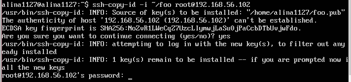 
 
设置免密登录目标主机  
  * 修改目标主机sshd_config配置
  ```PasswordAuthentication no```  
  ```PermitRootLogin without-password```  
  * 重启ssh服务  
  ```sudo systemctl restart ssh```  

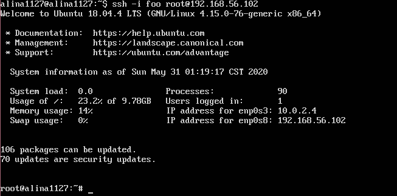  

参考资料  
[openssh实现key验证免密码登录](https://www.cnblogs.com/m9ll/articles/10747973.html)  

#### FTP  
实验工具  
* vsftpd  

实验过程  
1. 编辑脚本文件vsftpd.sh  
2. 将脚本文件传送至目标主机192.168.56.102  
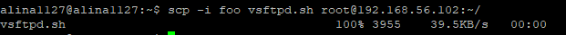  

3. 运行vsftpd.sh  
  ```ssh -i foo root@192.168.56.102 bash vsftpd.sh```  
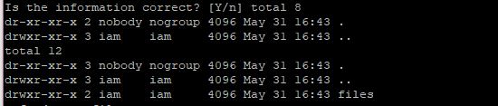

实验结果  
 - [x] 配置一个提供匿名访问的FTP服务器，匿名访问者可以访问1个目录且仅拥有该目录及其所有子目录的只读访问权限；  
* 实现匿名访问  
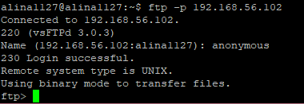  
 - [x] 配置一个支持用户名和密码方式访问的账号，该账号继承匿名访问者所有权限，且拥有对另1个独立目录及其子目录完整读写（包括创建目录、修改文件、删除文件等）权限；  
* 配置账号iam  
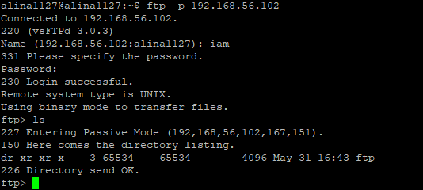  
 - [x] FTP用户不能越权访问指定目录之外的任意其他目录和文件；  
 - [x] 匿名访问权限仅限白名单IP来源用户访问，禁止白名单IP以外的访问；  
* 允许物理主机192.168.56.101访问  

参考资料  
[How To Set Up vsftpd for a User's Directory on Ubuntu 18.04](https://www.digitalocean.com/community/tutorials/how-to-set-up-vsftpd-for-a-user-s-directory-on-ubuntu-18-04)  
[linux-2019-luyj](https://github.com/CUCCS/linux-2019-luyj/blob/Linux_exp0x06)

#### NFS  
实验过程  
1. 编辑脚本文件nfs1.sh和nfs2.sh  
2. 将nfs1.sh传送至目标主机192.168.56.102  
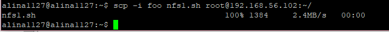  

3. 工作主机运行nfs2.sh  

实验结果  
 - [x] 在1台Linux上配置NFS服务，另1台电脑上配置NFS客户端挂载2个权限不同的共享目录，分别对应只读访问和读写访问权限；  
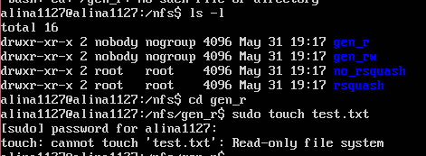  
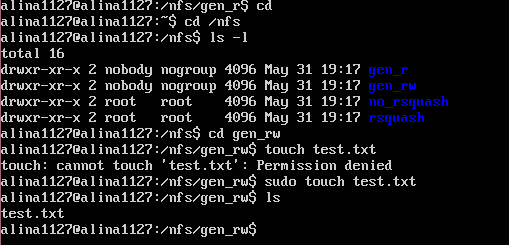  
 - [x] 共享目录中文件、子目录的属主、权限信息；  
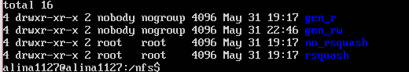  
 - [x] 上述共享目录中文件、子目录的属主、权限信息和在NFS服务器端上查看到的信息一样吗？  
* 不一样，在NFS服务器端仅能查看到相同的用户名和用户组名  

参考资料  
[NFS服务器的安装与配置](https://www.cnblogs.com/winter1519/p/7396135.html)

#### DHCP  
实验过程  
1. 服务器端  
```
enp0s9:
      dhcp4: no
      dhcp6: no
      dhcp-identifier: mac
      addresses: [192.168.57.1/24]
```  
2. 客户端  
```
enp0s9:
      dhcp4: yes
      dhcp6: yes
```  
3. 编辑脚本文件DHCP.sh  
4. 运行脚本文件DHCP.sh  
5. 修改isc-dhcp-server配置文件  
```
INTERFACESv4="enp0s9"
INTERFACESv6="enp0s9"
```  

实验结果  
```sudo netstat -uap```  
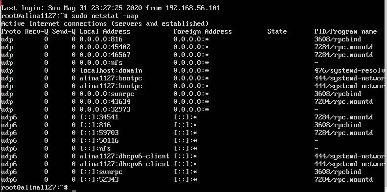  

参考资料  
[linux-2019-luyj](https://github.com/CUCCS/linux-2019-luyj/blob/Linux_exp0x06/Linux_exp0x06/Linux_exp0x06.md)

#### DNS  
实验过程  
1. 服务器端  
 * ```sudo apt-get install bind``` 安装bind  
 * 修改named.conf.options配置文件  
 ```sudo vim /etc/bind/named.conf.options```  
```
listen-on { 192.168.56.101; };  
allow-transfer { none; };  
forwarders 
{8.8.8.8;
 8.8.4.4;};
```
 * 编辑配置文件named.conf.local  
 ```sudo vim /etc/bind/named.conf.local```  
 * 生成目标配置文件  
 ```sudo cp /etc/bind/db.local /etc/bind/db.cuc.edu.cn```
2. 客户端  
 * ```sudo apt-get install resolvconf``` 安装resolvconf  
 * 修改配置文件  
 `sudo vim /etc/resolvconf/resolv.conf.d/head`  
```
   search cuc.edu.cn    
   nameserver 192.168.56.101
```  

实验结果  
 - [x] 基于上述Internal网络模式连接的虚拟机实验环境，在DHCP服务器上配置DNS服务，使得另一台作为DNS客户端的主机可以通过该DNS服务器进行DNS查询；  
 - [x] 在DNS服务器上添加 zone "cuc.edu.cn" 的解析记录；  

参考资料  
[DNS on Ubuntu 18.04](https://datawookie.netlify.app/blog/2018/10/dns-on-ubuntu-18.04/)
#### Samba  
实验过程  
1. 编辑脚本文件sam.sh  
2. `sudo apt-get update` 更新缓存  
3. ```bash sam.sh``` 执行脚本文件  

实验结果
* 命令行输入`\\192.168.56.101`  

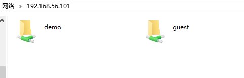  
* Linux设置匿名访问共享目录  
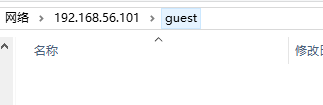
* Linux设置用户名密码方式的共享目录  
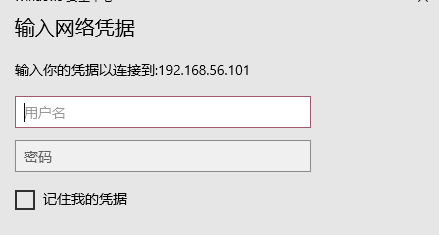  

参考资料  
[Setting up Samba as a Standalone Server](https://wiki.samba.org/index.php/Setting_up_Samba_as_a_Standalone_Server)  