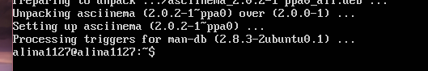
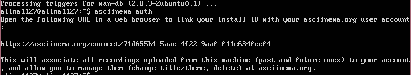

# Linux第二次实验报告  
##From GUI to CLI  
###实验环境
>Ubuntu 18.04.4 Server  
>asciinema  
###实验过程  
####1.安装asciinema

	sudo apt install asciinema
   

	asciinema auth
  
查看到已经成功连接  
####2.录制vimtutor学习过程    
[Lesson 1](https://asciinema.org/a/1AaHu89OZ9rU2wZZMYUWUZJTl)   
[Lesson 2](https://asciinema.org/a/AuvLEXkS3Jf7qYjmYcwFJwul9)  
[Lesson 3](https://asciinema.org/a/DSWln02J0mBDi0pd93is8E1H1)  
[Lesson 4](https://asciinema.org/a/cQzbQwL7tbL1h3oHkY76mDmZj)  
[Lesson 5](https://asciinema.org/a/5kRG1xkdQfieUbGVT047MSnz3)  
[Lesson 6](https://asciinema.org/a/sohQW4l6Bk2JIdjf09UzxGGqG)  
[Lesson 7](https://asciinema.org/a/RwlTYwuqFQ0rHwwzDjiLuRIAq)  
####自查
  
#####你了解vim有哪几种工作模式？  
* Normal Mode   (一般状态下的通常模式 
* Insert Mode   (写入模式，可以进行文本写入
* Visual Mode   (可视化模式
* 末行模式   (即在退出之前所进入的状态 ```：q```等  

#####Normal模式下，从当前行开始，一次向下移动光标10行的操作方法？如何快速移动到文件开始行和结束行？如何快速跳转到文件中的第N行？  
1. 向下移动光标10行：```10j```
2. 移动到开始行：```gg```
3. 移动到结束行:```G```
4. 快速跳转到第N行：```NG/Ngg```

#####Normal模式下，如何删除单个字符、单个单词、从当前光标位置一直删除到行尾、单行、当前行开始向下数N行？
1. 删除单个字符：```x```
2. 删除单个单词：```dw```
3. 从当前光标删除至行尾：```d$```
4. 从当前光标删除单行：```dd```
5. 从当前光标删除下数N行：```Ndd```

#####如何在vim中快速插入N个空行？如何在vim中快速输入80个-？
* 快速插入N个空行：```N o ESC```
* 快速输入80个-：```80 i - ESC```

#####如何撤销最近一次编辑操作？如何重做最近一次被撤销的操作？
* 撤销最近一次的编辑操作：```u```
* 重做最近一次被撤销的操作：```Ctrl-r```

#####vim中如何实现剪切粘贴单个字符？单个单词？单行？如何实现相似的复制粘贴操作呢？
* 剪切粘贴单个字符：```x p/d p```
* 剪切粘贴单个单词：```dw p```
* 剪切粘贴单行：```dd p```
* 复制粘贴操作：

   1. ```v``` 选择要复制的内容
   2. ```y ESC``` 复制
   3. ```p``` 粘贴

#####为了编辑一段文本你能想到哪几种操作方式（按键序列）？  
* 复制粘贴操作：（如上
* 插入：```i```
* 替换：```:s/old/new(/g```
* 删除
* 修改：```:ce```

#####查看当前正在编辑的文件名的方法？查看当前光标所在行的行号的方法？  
```Ctrl-G```

#####在文件中进行关键词搜索你会哪些方法？如何设置忽略大小写的情况下进行匹配搜索？如何将匹配的搜索结果进行高亮显示？如何对匹配到的关键词进行批量替换？  
* 关键词搜索方法：
    
   1. ```/关键词```
   2. ```?关键词```
* 忽略大小写：```:set ic```
* 高亮显示：```:set hls is```
* 批量替换：```:s/old/new/g```

#####在文件中最近编辑过的位置来回快速跳转的方法？  
* 向前：```Ctrl-o```
* 向后：```Ctrl-i```

#####如何把光标定位到各种括号的匹配项？例如：找到(, [, or {对应匹配的),], or }    
把光标停留在当前匹配项 **命令```%```** 光标自动跳转

#####在不退出vim的情况下执行一个外部程序的方法？  
```:! 外部程序名称```

#####如何使用vim的内置帮助系统来查询一个内置默认快捷键的使用方法？如何在两个不同的分屏窗口中移动光标？  
* 查询内置默认快捷键：```help 名称```
* 分屏窗口移动光标：```Ctrl-w```