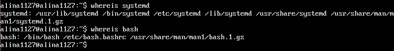
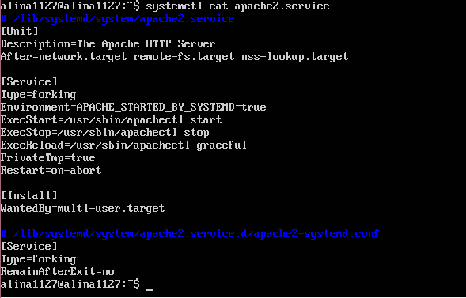
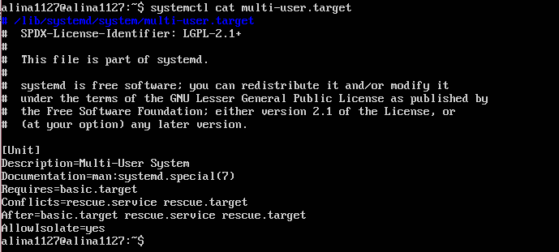
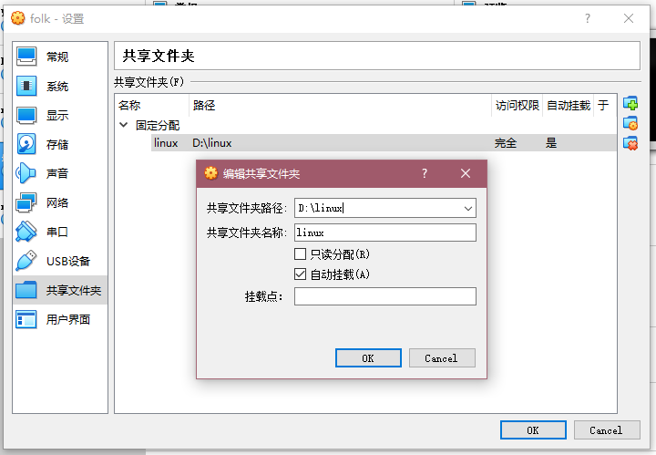

# Linux第三次实验报告  

## 动手实战Systemd
  
### 实验环境  

>Ubuntu 18.04.4 Server  
>asciinema    

### 实验过程  
#### Systemd 入门教程：命令篇  
 由来： 
 
* 无法使用 ```sudo service apache2 start``` （Ubuntu18开始不支持init进程  

[Systemd概述+系统管理](https://asciinema.org/a/bz47QzPuIUbGk1VhOFvy2vDni)  

* ```sudo timedatectl set-time```无法执行 （根据当前的时区自动设置
  
[Unit](https://asciinema.org/a/QV7J2D03Xql4A5BTLnMOPHTIj)  
[Unit的配置文件](https://asciinema.org/a/KRx4DSTioIGWuBxlo6qU5iekK)  
[Target](https://asciinema.org/a/pFwgcqoy6bz98IO6m6HFzIwj3)  
[日志管理](https://asciinema.org/a/T9VgSKkNDpIqx1rm7feWwMmEw)
  
* ```sudo journalctl /usr/lib/systemd/systemd```无法执行  
* ```sudo journalctl /usr/bin/bash```无法执行  
* 错误原因：没有找到当前文件或目录
* 解决方法：重新查找所在路径，成功执行  


#### Systemd 入门教程：实战篇  
[开机启动+启动服务+停止服务](https://asciinema.org/a/pc1W4lwJPWRJ57eksrYHmwNiK)
##### 读懂配置文件（以apache2.service为例
  

* [Unit]区块：启动顺序与依赖关系
 1. ```Description```字段：apache2.service的简单描述
 2. ```After```字段：apache2.service应该在network.target/remote-fs.target/nss-lookup.target之后启动
  
* [Service]区块：启动行为
 1. ```Type```字段：定义启动类型  
     * forking（ExecStart字段将以fork()方式启动，此时父进程将会退出，子进程将成为主进程
 2. ```ExecStart```字段：定义启动进程时执行的命令
 3. ```ExecStop```字段：停止服务时执行的命令
 4. ```ExecReload```字段：重启服务时执行的命令
 5. ```Restart```字段：定义退出后的重启方式  
     * on-abort（只有在收到没有捕捉到的信号终止时，才会重启
 6. ```PrivateTmp```字段：表示分配独立的tmp空间，保证一定的安全性

* [Install]区块：定义如何安装配置文件
 1. ```WantedBy```字段：表示该服务所在的Target
##### Target的配置文件  
  

* [Unit]区块：
  * ```Description```字段：multi-user.target的简单描述

  * ```Documentation```字段：当前文件所在的位置信息

  * ```Requires```字段：要求basic.target一起运行

  * ```Conflicts```字段：冲突字段，和rescue.service/rescue.target不能同时运行

  * ```After```字段：multi-user.target要在basic.target/rescue.service/rescue.target之后运行

  * ```AllowIsolate```字段：允许使用```systemctl isolate```命令切换到multi-user.target  


### 自查清单
* 如何添加一个用户并使其具备sudo执行程序的权限？  
  1. 添加用户：```useradd username```
  2. 更改权限：```usermod -a -G adm username```
* 如何将一个用户添加到一个用户组？  
```usermod -a -G groupname username```
* 如何查看当前系统的分区表和文件系统详细信息？  
  * ```df -lh```通过这个命令实现查看磁盘的使用情况以及文件系统被挂载的位置
  * ```fdisk -l```通过这个命令获得机器中所有的硬盘的分区情况
* 如何实现开机自动挂载Virtualbox的共享目录分区？  
 1. 用VirtualBox虚拟机的共享文件夹设置共享的本地文件  
  
 2. ```mkdir /mnt/share``` 在/mnt路径下创建共享目录  
 3. 实现挂载 ```mount -t vboxsf linux /mnt/share```  
 4. 实现开机自启动   
     * 在文件 /etc/rc.local 中追加命令```mount -t vboxsf linux /mnt/share```    
 
 参考文献：[VirtualBox共享文件夹设置及开机自动挂载](https://blog.csdn.net/ysh198554/article/details/73335844)

* 基于LVM（逻辑分卷管理）的分区如何实现动态扩容和缩减容量？  
动态扩容：```lvextend -L +2G /dev/VGtest1/LVtest1```  
缩减容量：```resize2fs /dev/VGtest1/LVtest1 1G```  
参考文献：[LVM逻辑卷管理](https://blog.51cto.com/13691477/2299707)
* 如何通过systemd设置实现在网络连通时运行一个指定脚本，在网络断开时运行另一个脚本？  
   * 修改networking中的[Service]区块  
   ```ExecStartPost = <path1> service1```（启动服务之后执行的命令  
   ```ExecStopPost = <path2> service2``` （停止服务之后执行的命令  
* 如何通过systemd设置实现一个脚本在任何情况下被杀死之后会立即重新启动？实现杀不死？  
   * [Service]区块的一些字段定义了重启行为  
   ```Restant = always```（不管是什么退出原因，总是重启