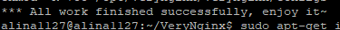
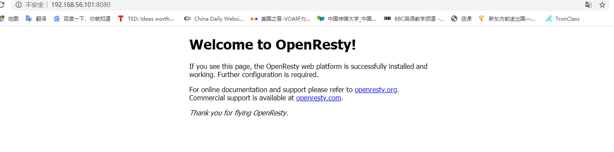
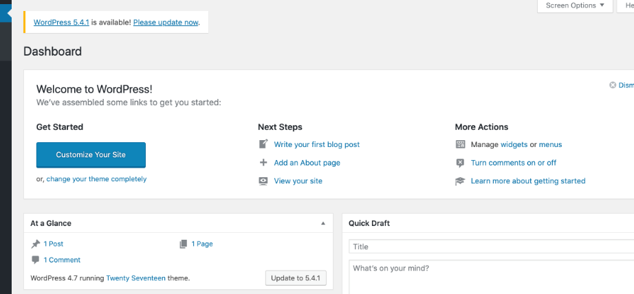
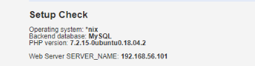
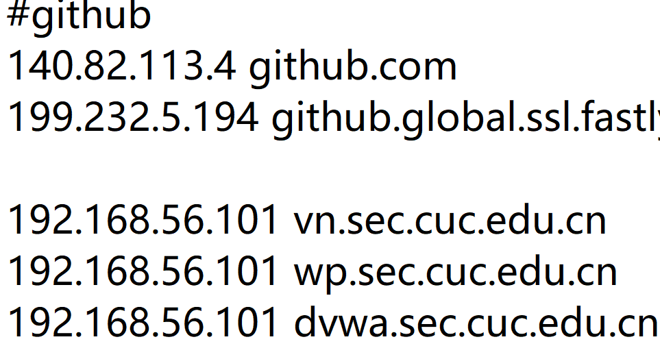
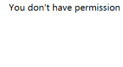
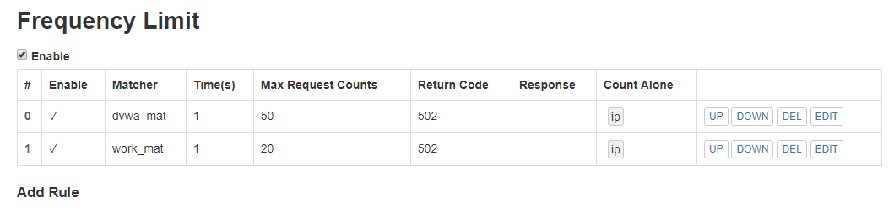

# Linux第五次实验报告  

## Web服务器  

### 实验环境  
>Windows 10  
>putty  
>Wordpress 4.7  
>DVWA
>Ubuntu 18.04.4 Server
>>nginx  
>>VeryNginx 

### 实验过程  

#### 安装配置nginx  
1. ```sudo apt install nginx``` 安装nginx  
2. ```sudo systemctl start nginx``` 启动nginx  

#### 安装配置VeryNginx
1. 安装VeryNginx  
 * ```git clone https://github.com/alexazhou/VeryNginx.git``` 克隆VeryNginx仓库到本地
 * ```sudo apt install python``` 安装python  
 * ```sudo apt-get install libpcre3 libpcre3-dev``` 安装libpcre3库   
 * ```sudo apt-get install libssl-dev libssl-dev``` 安装libssl库  
 * ```sudo apt install gcc``` 缺少gcc会无法编译  
 * ```sudo apt install make``` 安装make  
 * ```sudo apt-get install zlib1g-dev``` 安装zlib库  
 * ```cd VeryNginx``` 切换目录  
 * ```sudo python install.py install```  
  
2. 配置VeryNginx  
 *  ```sudo vim /opt/verynginx/openresty/nginx/conf/nginx.conf```  
     *  ```user www-data```  
     *  ```server {listen 192.168.xx.xxx..:8080```  
 * ```su root```
 * ```/opt/verynginx/openresty/nginx/sbin/nginx``` 启动服务  
  

#### 安装wordpress4.7  
1. ```sudo apt install mysql-server``` 安装mysql  
 * ```mysql -u root -p``` 进入mysql  
 * ```CREATE DATABASE wordpress DEFAULT CHARACTER SET utf8 COLLATE utf8_unicode_ci;``` 创建wordpress数据库  
 * ```GRANT ALL ON wordpress.* TO 'wordpressuser'@'localhost' IDENTIFIED BY 'password';```  
 * ```FLUSH PRIVILEGES;``` 刷新
2. ```sudo apt install php-fpm php-mysql``` 安装php  
3. ```sudo vim /etc/nginx/sites-enabled/default``` 修改nginx的配置文件  
4. ```wget https://github.com/WordPress/WordPress/archive/4.7.zip``` 下载wordpress4.7  
5. ```sudo sed -i s/database_name_here/wp_db/ wp-config.php``` 修改相应的配置文件  


#### 连接wordpress和nginx  
1. 新建配置文件，端口设置为8080  
  * ```WP_DOMAIN=wp.sec.cuc.edu.cn```  
  * ```WP_PORT=8080```  
2. 建立连接并启动nginx  
   * ```sudo ln -s /etc/nginx/sites-available/${WP_DOMAIN} /etc/nginx/sites-enabled/```  
   * ```sudo nginx```  
3. 在主机hosts中添加```192.168.56.101 http://wp.sec.cuc.edu.cn/```  

#### 安装配置DVWA  
1. ```sudo git clone https://github.com/ethicalhack3r/DVWA``` 下载DVWA  
2. ```mv DVWA /tmp/DVWA``` 移动至/tmp文件夹  
3. 与mysql进行连接  
 * ```CREATE DATABASE dvwa DEFAULT CHARACTER SET utf8 COLLATE utf8_unicode_ci;``` 创建DVWA数据库  
 * ```GRANT ALL ON dvwa.* TO 'dvwauser'@'localhost' IDENTIFIED BY 'psssp12';```
 * ```FLUSH PRIVILEGES;```  
4. ```sudo systemctl restart mysql``` 重启mysql  
5. 再次修改php文件配置  
 * ```sudo vim /etc/php/7.2/fpm/php.ini```  
 * ```sudo systemctl restart php7.2-fpm``` 重启生效  
6. 再将nginx的配置文件增加端口 ```listen 8000``` 
7. ```sudo ln -s /etc/nginx/sites-available/dvwa /etc/nginx/sites-enabled/``` 创建软连接 
8. ```sudo nginx -s reload``` 更新nginx配置  
  

#### 配置verynginx端口  
* 配置matcher、配置Proxy Pass  
* ep:
 
  

  
* 更改主机hosts文件  

#### 实验结果  
 - [x] 在一台主机（虚拟机）上同时配置Nginx和VeryNginx  
  VeryNginx作为本次实验的Web App的反向代理服务器和WAF  
  PHP-FPM进程的反向代理配置在nginx服务器上，VeryNginx服务器不直接配置Web站点服务  
 - [x] 使用Wordpress搭建的站点对外提供访问的地址为： http://wp.sec.cuc.edu.cn  
 - [x] 使用Damn Vulnerable Web Application (DVWA)搭建的站点对外提供访问的地址为： http://dvwa.sec.cuc.edu.cn


#### 安全加固  
1. 使用IP地址方式均无法访问上述任意站点，并向访客展示自定义的友好错误提示信息页面-1  
 * 设置matcher
 
 * 添加response  
 
 * 添加filter  
2. DVWA只允许白名单上的访客来源IP，其他来源的IP访问均向访客展示自定义的友好错误提示信息页面-2  
 * 步骤同上设置  
    * 设置matcher  
    * 添加response  
    * 添加filter
 * 非白名单访问时  
   
3. VeryNginx的Web管理页面仅允许白名单上的访客来源IP，其他来源的IP访问均向访客展示自定义的友好错误提示信息页面-3
 * 步骤同上设置    
4. 通过定制VeryNginx的访问控制策略规则实现：  
 * 限制DVWA站点的单IP访问速率为每秒请求数 < 50  
 * 限制Wordpress站点的单IP访问速率为每秒请求数 < 20  
   
5. 通过配置VeryNginx的Filter规则实现对DVWA的SQL注入实验在低安全等级条件下进行防护（有所借鉴  
   
 
### 参考文献  
[VeryNginx](https://github.com/alexazhou/VeryNginx/blob/master/readme_zh.md)  
[ubuntu下安装zlib的方法](https://blog.csdn.net/wu_cai_/article/details/80278611)  
[Nginx启动报错](https://blog.csdn.net/qq_37495786/article/details/82688044)  
[how-to-install-linux-nginx-mysql-php](https://www.digitalocean.com/community/tutorials/how-to-install-linux-nginx-mysql-php-lemp-stack-ubuntu-18-04)  
[linux-2019-luyj](https://github.com/CUCCS/linux-2019-luyj/blob/Linux_exp0x05/Linux_exp0x05/Linux_exp0x05.md)  
[mysql报错](https://blog.csdn.net/ssiyla/article/details/82931439)